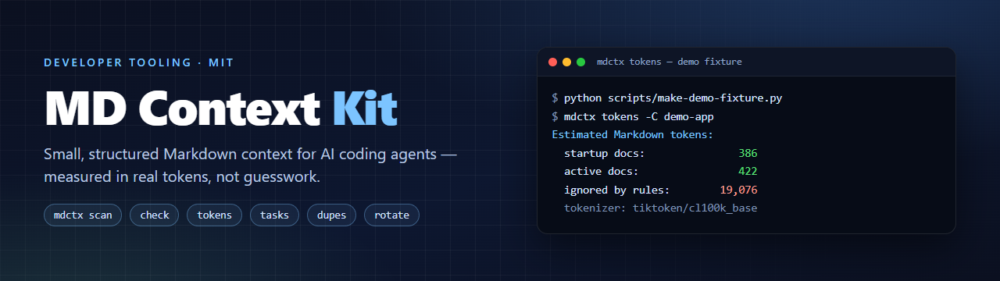
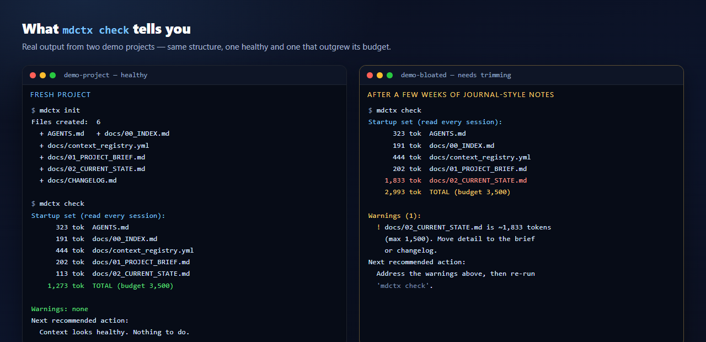
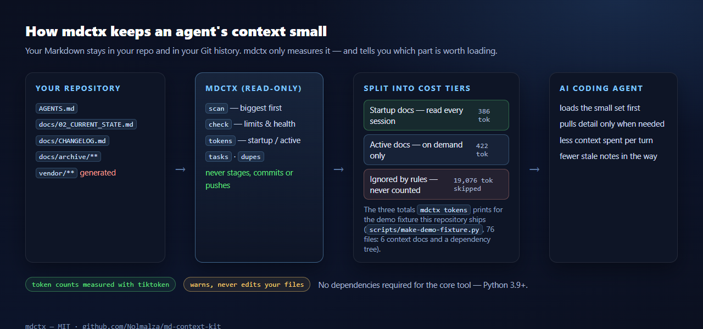
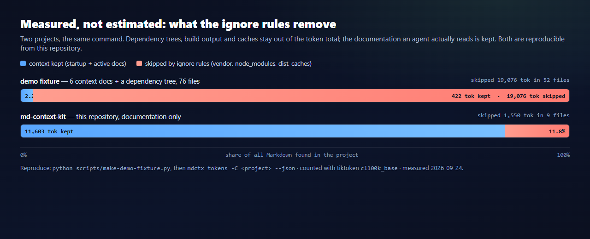

<div align="center">
  
</div>

# MD Context Kit

**Keep an AI coding agent's project context small, structured and measured.**

[](CHANGELOG.md)
[](pyproject.toml)
[](LICENSE)
[](tests/test_mdctx.py)
[](pyproject.toml)
[](CONTRIBUTING.md)

`mdctx` is a zero-dependency Python CLI for the Markdown an AI coding agent has to
read before it can work. It defines the smallest set of files the agent should read
every session, checks them against explicit line and token budgets, prices the reading
list of each task, and keeps older material in an archive that is never loaded by
default.

It **measures and suggests** — it never edits your code, stages, commits or pushes.

## The problem

- **Docs grow without bound.** A "current state" note quietly becomes a journal.
- **Old and current information mix**, so neither a human nor an agent knows what still
  applies — and a stale note is worse than no note.
- **History gets duplicated into Markdown** (diffs, logs, whole files) even though Git
  already stores it.
- **Token cost is invisible** until a session burns its context window on paperwork.

Agents re-read that folder on every session, sometimes on every turn. Everything you add
early is paid for again on each later turn.

## Quick start

```bash
git clone https://github.com/Nolmalza/md-context-kit
cd md-context-kit
python -m venv .venv && source .venv/bin/activate     # Windows: .venv\Scripts\activate
pip install -e ".[tokens]"                            # tiktoken = accurate token counts
```

Then, in any project:

```bash
cd ~/my-project
mdctx init          # create the context files from templates
mdctx check         # are they present, within budget, and healthy?
mdctx tokens        # what does an agent pay per session?
mdctx scan          # which docs are biggest? (largest first)
```

Nothing is written unless you ask: files are only created by `mdctx init` or
`mdctx refresh --apply`. Not on PyPI yet — install from source as above.

## See it work

<div align="center">
  
</div>

A healthy startup set costs **1,273 tokens**; once that folder turns into a journal,
`check` says exactly which file broke which budget and what to do about it.

## How it works

<div align="center">
  
</div>

1. **Startup docs** — the few files an agent reads first, every session
   (`AGENTS.md`, `docs/00_INDEX.md`, `docs/context_registry.yml`,
   `docs/01_PROJECT_BRIEF.md`, `docs/02_CURRENT_STATE.md`).
2. **On-demand docs** — everything else, read only when a task needs it.
3. **Archive and generated noise** — kept in the repository (Git is the history), but
   excluded from context and from the token count.

The registry gives every context file a stable `id`, a `type`, a `status`, a `read_when`
hint (`startup`, `on-demand`, `never`) and a `scope`, so rules can be referenced instead
of repeated. See [docs/registry-format.md](docs/registry-format.md).

## Measured, reproducibly

<div align="center">
  
</div>

Dependency, build and cache folders (`vendor`, `node_modules`, `dist`, `build`,
`target`, `__pycache__`, …) are ignored by default, and every command reports how many
files and tokens the rules removed — so the numbers stay explainable. Both rows are
re-creatable from a clone:

```bash
python scripts/make-demo-fixture.py      # prints the demo project's path
mdctx tokens -C <printed path> --json    # the demo fixture row
mdctx tokens -C . --json                 # this repository's row
```

## Features

- `init`, `check` (`--strict`), `scan` (`--all`), `tokens`, `tasks`, `dupes`,
  `refresh` (`--apply`), `snapshot`, `rotate`.
- `--json` on every command, for agents and CI.
- `.mdctxignore` + `mdctx.json`: per-project ignore rules, limits and startup set.
- `mdctx tasks` prices each reading list in `context_registry.yml`; `mdctx dupes` finds
  context files that cost tokens twice.
- Registry health checks: dangling file references, `read_when: never` files that are
  still startup docs, and "loose" docs no section points at.
- Accurate counts via `tiktoken`, with a language-aware fallback for when it is missing
  (Thai ≈ 1 token per character, Latin ≈ 4 characters per token — not a flat `chars / 4`).
- Generic, blank templates you adapt to your project.

## CLI reference

| Command | What it does |
|---|---|
| `mdctx init` | Create missing context files from templates |
| `mdctx check [--strict] [--json]` | Required files, limits, registry health; `--strict` exits non-zero on warnings |
| `mdctx scan [--all]` | Context files with line/token counts, largest first |
| `mdctx tokens [--json]` | Startup / active / all-docs token totals, plus what the rules ignored |
| `mdctx tasks` | Token cost of each task's reading list |
| `mdctx dupes` | Files whose content is identical but counted twice |
| `mdctx refresh [--apply] [--tokens]` | Report (or create) what the structure is missing |
| `mdctx snapshot` | Create a short dated snapshot in `docs/snapshots/` |
| `mdctx rotate` | Move old snapshots to `docs/archive/snapshots/` (keeps the newest) |

`python -m md_context_kit.cli <command>` also works.

## Configuration

Both files are optional and live in the project root. `.mdctxignore` takes one pattern
per line (`#` starts a comment); `mdctx.json` holds structured overrides:

```json
{
  "ignore": ["artifacts/**"],
  "required_files": ["AGENTS.md", "docs/02_CURRENT_STATE.md"],
  "startup_files": ["AGENTS.md", "docs/02_CURRENT_STATE.md"],
  "current_state": "docs/02_CURRENT_STATE.md",
  "changelog": "docs/CHANGELOG.md",
  "registry": "docs/context_registry.yml",
  "limits": { "startup_total_warn_tokens": 3500 }
}
```

## Budgets `mdctx` warns about (never edits)

| Target | Limit |
|---|---|
| `docs/02_CURRENT_STATE.md` | 120 lines / 1,500 tokens |
| Changelog | 3,000 tokens |
| Any single active Markdown file | warn above 2,500 tokens |
| Startup docs total | warn above 3,500 tokens |

All four are configurable per project. See [docs/token-limits.md](docs/token-limits.md).

## Recommended layout

```
your-project/
├── AGENTS.md                     how an agent should read this project
└── docs/
    ├── 00_INDEX.md               map of the context docs
    ├── context_registry.yml      machine-readable registry
    ├── 01_PROJECT_BRIEF.md       stable overview, rules, decisions
    ├── 02_CURRENT_STATE.md       short snapshot of where things stand
    ├── CHANGELOG.md              dated update summaries
    ├── snapshots/                short dated snapshots
    └── archive/                  older material; never read by default
```

## Workflow: refresh → snapshot → rotate

Bring a project back to the expected structure (`mdctx refresh`, or `refresh --apply`),
freeze a dated view at a milestone (`mdctx snapshot`), and move what has aged out of the
active set (`mdctx rotate`). Archive content is preserved for history but **not read by
default**, so it never inflates a session.

## Safety rules

- Never modifies application code — only Markdown context files, only when asked.
- Never runs `git commit`, never stages, never pushes; it *prints* a suggested command.
- Never reads `docs/archive/` by default.
- No telemetry, no network calls, no dependencies required for the core tool.

## Documentation

[docs/why-md-context-kit.md](docs/why-md-context-kit.md) ·
[docs/usage.md](docs/usage.md) ·
[docs/token-limits.md](docs/token-limits.md) ·
[docs/registry-format.md](docs/registry-format.md) ·
[docs/public-template-rules.md](docs/public-template-rules.md) ·
[CHANGELOG.md](CHANGELOG.md)

## Contributing

Issues and pull requests are welcome — see [CONTRIBUTING.md](CONTRIBUTING.md) and
[SECURITY.md](SECURITY.md). Run the test suite with `pip install -e ".[dev]" && pytest`.

## License

[MIT](LICENSE) © 2026 Nolmalza.
